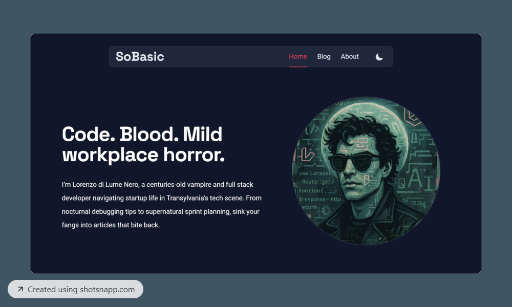

# So Basic - Astro Blog Template

Howdy! Before you read anything below, you can check out the ✨ [Live Demo](https://sobasic.netlify.app/) ✨

[](https://sobasic.netlify.app/)

[](https://stackblitz.com/github/lukeska/sobasic)
[](https://codesandbox.io/p/sandbox/github/lukeska/sobasic)
[](https://codespaces.new/lukeska/sobasic?devcontainer_path=.devcontainer/devcontainer.json)

## 📦 Installation

### Astro installation

```sh
bun create astro@latest -- --template lukeska/sobasic
```

### Manual installation

#### 1. Clone the repo
```sh
git clone https://github.com/lukeska/sobasic.git my-project
# or
git clone https://github.com/lukeska/sobasic.git .
```
The . will clone it to the current directory so make sure you are inside your project folder first.

#### 2. Install dependencies
```sh
bun install
```

#### 3. Start the development server
```sh
bun dev
```
## 🚀 Project Structure

Inside of your Astro project, you'll see the following folders and files:

```text
/
├── public/               
│   └── favicon.svg 
├── src/
│   ├── components/        
│   ├── content/          
│   │   └── blog/
│   ├── images/
│   ├── layouts/          
│   ├── pages/           
│   │   └── index.astro
│   └── styles/          
├── astro.config.mjs     
└── package.json         
```

Astro looks for `.astro` or `.md` files in the `src/pages/` directory. Each page is exposed as a route based on its file name.

There's nothing special about `src/components/`, but that's where we like to put any Astro/React/Vue/Svelte/Preact components.

Any static assets, like images, can be placed in the `public/` directory.

## 📰 Add your own content

### Add or change existing pages

Feel free to change any of the content on the existing files in folder `src/pages/`. In this folder you 
can add any `.astro` file. Make sure to use `<BaseLayout> to ensure any new page looks like the rest of the site.

```html
---
import BaseLayout from "../layouts/BaseLayout.astro";
---
<BaseLayout>
    <!-- your content here -->
</BaseLayout>
```

### Add new articles to the blog

Articles for the blog can be added as `.md` or `.mdx` files inside `src/content/blog/`. Hero images for the articles can be added to `src/images/`

Make sure to add the following data at the top of your file:

```html
---
title: 'This is my title'
description: 'This is my description'
pubDate: '2025-01-02'
heroImage: '../../images/article-image.jpg'
featured: true
---
```

- title is the title and meta title for the article
- description is used as short text in list of articles and as meta description
- pubDate is the publication date, used to sort articles in lists
- heroImage is optional and references an image inside `src/images/`
- featured is optional. Values can be `true` or `false`. It defines if an article is visible in the `FeaturedArticles.astro` component.

### Change links in the main navigation

Links in the main navigation can be changed in `src/components/Header.astro` by altering this variable:

```javascript
const navItems = [
	{ href: "/", text: "Home", active: currentPath === "/" },
	{ href: "/blog", text: "Blog", active: currentPath.startsWith("/blog") },
	{ href: "/about", text: "About", active: currentPath.startsWith("/about") },
];
```

## 🎨 Customization

The primary color of this theme can be easily changed in `src/styles/global.css`.
You can assign any Tailwind color to the various `color-primary-*` variables.

```css
@theme {
    --color-primary-50: var(--color-purple-50);
    --color-primary-100: var(--color-purple-100);
    --color-primary-200: var(--color-purple-200);
    --color-primary-300: var(--color-purple-300);
    --color-primary-400: var(--color-purple-400);
    --color-primary-500: var(--color-purple-500);
    --color-primary-600: var(--color-purple-600);
    --color-primary-700: var(--color-purple-700);
    --color-primary-800: var(--color-purple-800);
    --color-primary-900: var(--color-purple-900);
    --color-primary-950: var(--color-purple-950);
    ...
}
```

## 👀 Want to learn more?

Feel free to check [Astro's documentation](https://github.com/withastro/astro) or jump into Astro's [Discord server](https://astro.build/chat).

## Images credits
Photos by <a href="https://unsplash.com/@josepmartins?utm_content=creditCopyText&utm_medium=referral&utm_source=unsplash">Josep Martins</a> on <a href="https://unsplash.com/photos/white-smoke-0-c5T6meRuk?utm_content=creditCopyText&utm_medium=referral&utm_source=unsplash">Unsplash</a>